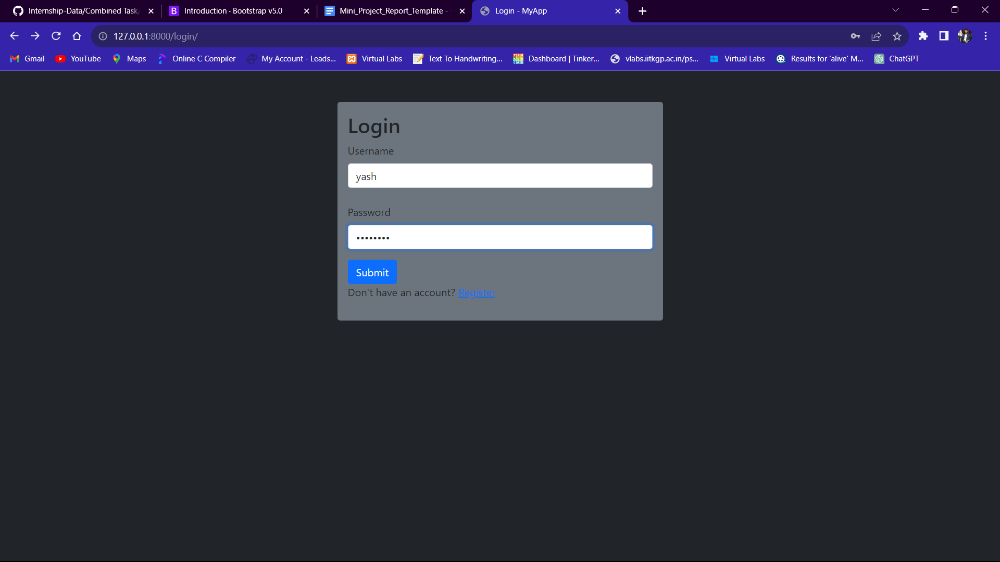

# Portfolio Flutter App

A cross-platform personal portfolio application built with Flutter, designed to showcase your projects, skills, and contact information. This app is responsive and works seamlessly on web, desktop, and mobile devices.

## Features

- **Modern UI**: Clean, responsive design with dark theme support.
- **Splash Screen**: Animated splash screen using Lottie animations.
- **About Section**: Introduction, background, and skills overview.
- **Projects Showcase**: Dynamic project listing with images, descriptions, tags, and links (GitHub, web, Android, iOS).
- **Contact & Social Links**: Easy access to your GitHub, LinkedIn, Instagram, Twitter, and email.
- **Footer**: Contact call-to-action and credits.
- **Firebase Integration**: Uses Firebase for project data and image hosting.
- **Custom Animations**: Lottie and custom animated widgets.

<!-- ## Screenshots

> Add your screenshots here (e.g. from `assets/images/` or `assets/project_images/`):
>
> 
> 
>  -->

## Tech Stack

- **Flutter** (Dart)
- **Firebase** (Firestore, Storage)
- **Lottie** (Animations)
- **Google Fonts**
- **Material Design**

## Skills & Technologies Highlighted

- Flutter, Dart, Firebase, GitHub, Git, Java, Python, ASP .Net, C#, HTML5, CSS3, JavaScript, C++, C

## Getting Started

### Prerequisites
- [Flutter SDK](https://flutter.dev/docs/get-started/install)
- [Firebase CLI](https://firebase.google.com/docs/cli) (for hosting/deployment)

### Installation
1. **Clone the repository:**
   ```bash
   git clone https://github.com/2810yash/Yash_Wairagade.git
   cd Yash_Wairagade
   ```
2. **Install dependencies:**
   ```bash
   flutter pub get
   ```
3. **Run the app:**
   - For web:
     ```bash
     flutter run -d chrome
     ```
   - For mobile/desktop:
     ```bash
     flutter run
     ```

### Firebase Setup
- Update your Firebase configuration in `main.dart` if you fork this repo.
- Make sure your Firestore and Storage rules are set up for your needs.

### Assets
- Images: `assets/images/`
- Lottie Animations: `assets/lottie/`
- Project Images: `assets/project_images/`

## Folder Structure

- `lib/` - Main source code
  - `src/screens/` - UI screens (Home, About, Projects, Footer, etc.)
  - `src/utils/` - Utilities (project data, skills, contacts)
  - `src/widgets/` - Reusable widgets (drawers, nav bar, project tiles)
- `assets/` - Images, Lottie files, project screenshots

## Contact

- **Email:** yash2810203@gmail.com
- **GitHub:** [2810yash](https://github.com/2810yash)
- **LinkedIn:** [yash-wairagade28](https://www.linkedin.com/in/yash-wairagade28/)
- **Instagram:** [@_ash_2810](https://www.instagram.com/_ash_2810/)
- **Twitter:** [@_Yash_Wairagade](https://twitter.com/_Yash_Wairagade)

---

> Designed & Built by Yash Wairagade 💙 with Flutter
